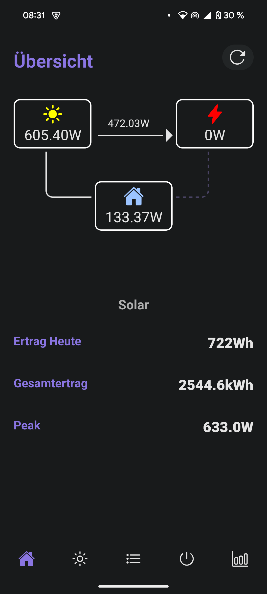
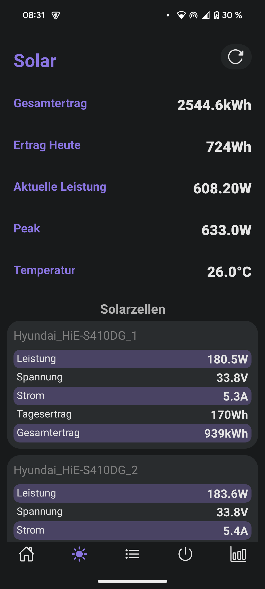
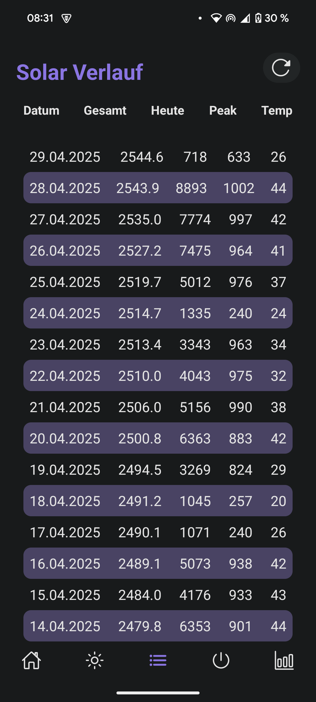
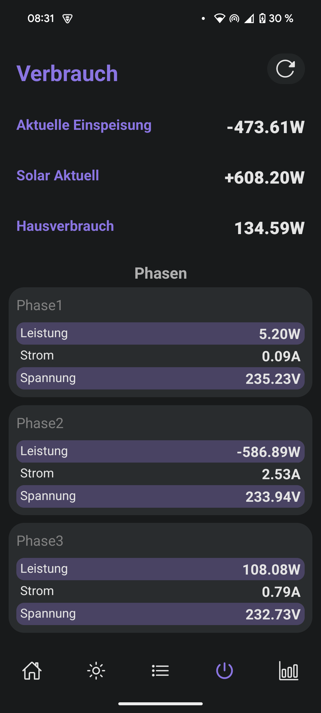
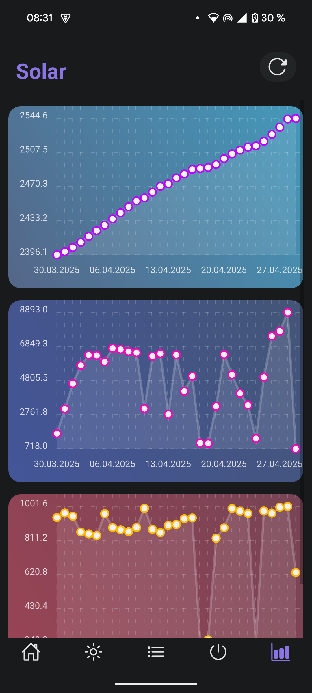

# Home Meter

☀️ Monitor of our home power usage and solar data all combined into one app.


### ✨ Features

- 🔋 Real-time display of house power usage
- ☀️ Live solar power generation updates
- 📈 Daily solar production history
- 🏠 Overview of total home power consumption
- 📊 Interactive graphs for usage and production
- 📅 Tabular history view for detailed analysis
- ⚡ Easy-to-read metrics and dynamic updates

### 📷 Screenshots
<div>
   





</div>

You can use the app as starting point, but it needs adaption for every usecase. 
Especially the way I get the data is a little more complex.

The alldata.txt looks the following:

Date|Total kWh|Daily Wh|Peak Wh|Peak Wh Time|Peak Temperature|Peak Temperature Time
```
19.03.2023|28.77|2187|871.4|11:07:15|46.3|14:22:01
20.03.2023|30.30|1533|232.0|20:47:33|25.4|20:47:33
```

I use a python script to read the OpenDTU api and collect the daily data like peak and temp peak. I upload the data to my server.
The python script also uploads the live data from OpenDTU and sends it to the server too.
Another python script handles the power consumption from our Shelly 3EM, the data is also send to my server. 

After that I just parse the data with this app and show it to the user.
The data from shelly and the api data from OpenDTU, follow the original format and I have not modified it.

You can simply add your own server address into the app, to show your own solar data.

